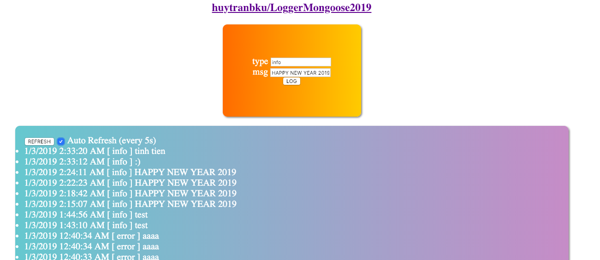

### Simple LOGGER with Express JS and Mongoose ###

*Default port is 8888*

*Default mongo port is 37017*

Docker
=======
cd docker

docker-compose up -d

Install
=======
npm start

For developer, start server
=======
npm run start:dev

For production, start server
=======
npm start

API usage
=======
POST /logger
{
  "msg": "message for logging",
  "type": "info"
}

or GET /logger/save?type=info&msg=message

GET /logger

Enjoy!
=======
Coder huytranbku
